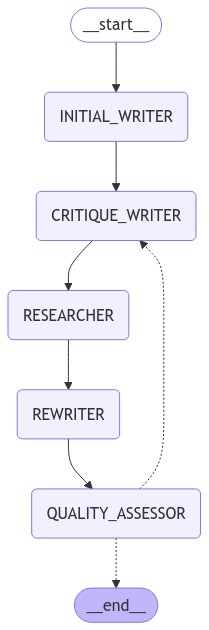

# Reflexion Agent

## Overview

This project implements a Reflexion agent (https://arxiv.org/pdf/2303.11366) in Langchain, designed to run entirely locally by utilizing the Llama 3.2 : 3b model via Ollama. I've based this on the version found on the official Langchain page (https://blog.langchain.dev/reflection-agents/), though I've made substantial modifications due to the need for more precise instructions when working with the Llama 3.2 model. I also implemented a graph architecture that is easier for me to understand and added a final quality assessment that decides whether to exit the Reflexion loop.”

## Graph Workflow

The agent follows a cyclic workflow through five key stages:

1. **Initial Writing** → Generates first answer using the LLM

2. **Critique** → Analyzes answer for:
   - Missing elements
   - Superfluous content
   - Outputs structured JSON feedback

3. **Research** → Uses critique to:
   - Generate targeted search queries
   - Perform web searches via Tavily API
   - Collect relevant information

4. **Rewriting** → Improves answer by:
   - Incorporating new research
   - Removing identified fluff
   - Adding source citations

5. **Quality Assessment** → Evaluates based on:
   - Completeness
   - Accuracy
   - Clarity

The graph will loop through steps 2-5 up to `MAX_ITERATIONS` times (default: 2) or until the quality meets requirements.


## Features

- Runs completely locally using Ollama (optional cloud LLM support available)
- Initial answer generation
- Self-critique and reflection with structured output using llama 3.2 : 3b
- Web search integration using Tavily Search API
- Answer rewriting with source citations

## Components

1. **Main Script**: The entry point that sets up the graph workflow.
   ```python:reflection_agent_own/main.py```

2. **Nodes**: Contains the core logic for different stages of the reflection process:
   - Initial answer generation
   - Self-critique
   - Web search integration
   - Answer rewriting
   ```python:reflection_agent_own/nodes/__init__.py```

3. **Chains**: Defines the LangChain prompt templates and chains for each node.
   ```python:reflection_agent_own/chains/__init__.py```

4. **Output Schemas**: Contains Pydantic models for structured outputs.
   ```python:reflection_agent_own/output_schemas/__init__.py```

5. **LLM Integration**: Provides functions to initialize different language models:
   - Ollama (local)
   - Groq (cloud)
   - Anthropic (cloud)
   ```python:reflection_agent_own/llm/__init__.py```

6. **State Management**: Defines the TypedDict for managing the agent's state.
   ```python:reflection_agent_own/state/__init__.py```

## Setup

1. Clone the repository
2. Install the required dependencies (you may want to use a virtual environment):
   ```
   pip install -r requirements.txt
   ```
3. Install Ollama from [ollama.ai](https://ollama.ai)
4. Pull your preferred ollama model:
   ```
   ollama pull llama3.2
   ```
5. Set up environment variables for additional features:
   - Create a `.env` file in the project root
   - Add API keys if you want to use cloud services:
     ```
     TAVILY_API_KEY=your_tavily_api_key  # Required for web search
     GROQ_API_KEY=your_groq_api_key      # Optional
     ANTHROPIC_API_KEY=your_anthropic_api_key  # Optional
     ```


## Customization

- Try out with your own questions in `main.py`
- Adjust the `MAX_ITERATIONS` in the main script to control the number of reflection cycles
- Choose between different LLM providers by modifying the LLM initialization in `main.py`:
  - `get_ollama_llm()` for local models
  - `get_groq_llm()` for Groq API
  - `get_anthropic_llm()` for Claude models

## important note

While working with Llama 3.2 I have noticed, that the prompt templates must follow a specific structure to work effectively. It is crucial to always include both system and user messages, if you want to generate structured output. The template should look something like this to work:
   ```python
   custom_structured_output_template = ChatPromptTemplate.from_messages([
       ("system", instruction),
       ("user", "Please provide the outputin the specified format.")
   ])
   ```